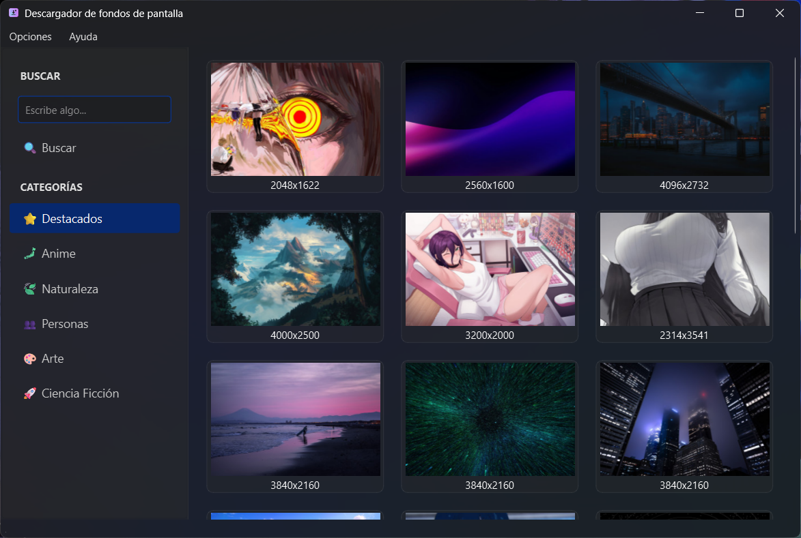
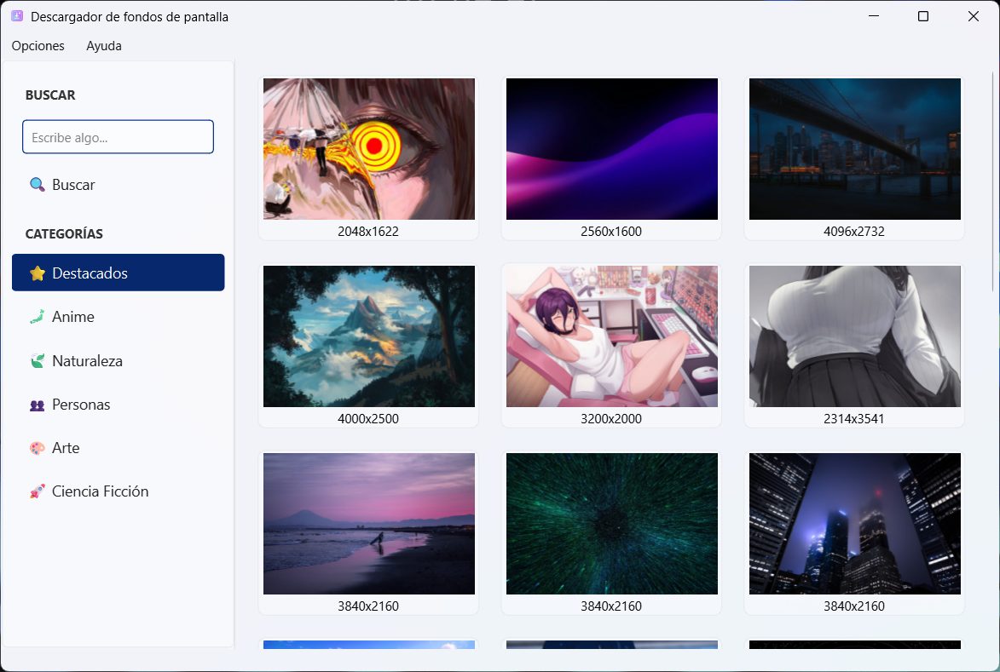
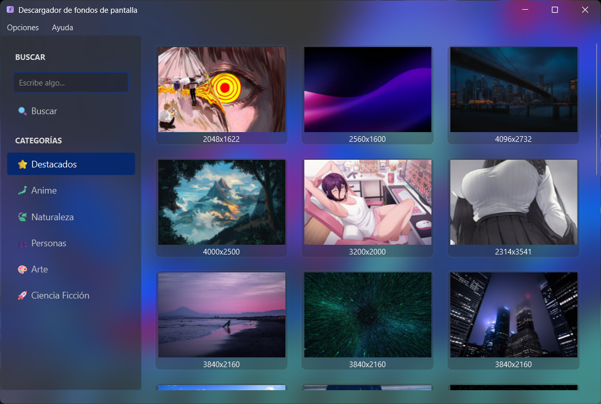
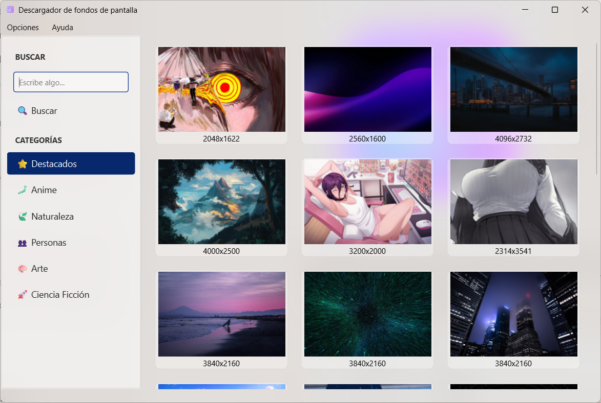

Wallpaper Downloader
====================


**Wallpaper Downloader** is a modern and lightweight desktop application designed to search, view, and download high-quality wallpapers using the [Wallhaven.cc](https://wallhaven.cc/) API.

Developed in C++ using the Qt 6 framework, the application focuses on offering a clean user interface, with support for light and dark themes, and native visual effects like Mica and Acrylic on Windows 11 (and also) blur support on KDE Plasma. (For Linux users)

## 📸 Screenshots

----------------------------------------

The application adapts its appearance according to the system theme or user preference.

| **Dark Theme (Mica/Acrylic Effect)**      | **Light Theme (Mica/Acrylic Effect)**       |
| ----------------------------------------- | ------------------------------------------- |
|        |        |
|  |  |

## ✨ Features

-----------------------------

* **Integrated Search:** Search for wallpapers by keywords.

* **Predefined Categories:** Quick access to popular categories like _Toplist_, _Anime_, _Nature_, _People_, _Art_, and _Sci-Fi_.

* **Infinite Scroll:** Automatic loading of more results when scrolling down (automatic pagination).

* **Native Style Integration:**
  
  * **Windows 11:** Support for **Mica** (performance) and **Acrylic** (translucent/blur) background effects.
  
  * **Linux (KDE Plasma):** Integration with KWindowEffects for background blur.
  
  * Automatically detects the system accent color on Windows and Linux (KDE Plasma).

* **Themes:** Support for Light and Dark modes, with automatic system theme detection.

* **Download Management:**
  
  * Progress bar integrated into the interface.
  
  * Custom selection of the destination folder.
  
  * Direct opening of the downloaded file location.

* **Preview:** View the image in a dialog before opening the folder.

* App support spanish translation (si el idioma de tu sistema es español)

🛠️ Technologies Used
--------------------------

The project is built using the following technologies and libraries:

* **Language:** C++

* **UI Framework:** Qt 6 (Modules: Widgets, Network).

* **Build System:** CMake 3.16+.

* **API:** [Wallhaven API v1](https://wallhaven.cc/help/api).

* **Specific Dependencies:**
  
  * _Windows:_ `Dwmapi.lib` (for immersive effects).
  
  * _Linux:_ `KF6 WindowSystem` and `KF6 Config` (for KDE integration).

⚙️ Configuration and Compilation
------------------------------

### Prerequisites

Ensure you have the following installed:

* C++ compiler compatible with C++17.

* Qt 6 SDK.

* CMake.

* (Linux) KF6 development libraries if you want transparency effects.

### Build Instructions

```bash
# Clone te repository 
git clone https://github.com/tu-usuario/wallpaper-downloader.git 
cd wallpaper-downloader 
# Setup build dir 
mkdir build && cd build 
# Configure with CMake 
cmake .. 
# Build 
cmake --build .
```

------

📄 License
-----------

This project is distributed under the GNU Lesser General Public License v2.1 (LGPL-2.1).

See the LICENSE file for more details.

## 👤 Autor

--------

Created by Jesus Chapman.

A simple application to download wallpapers using the Wallhaven API and Qt technologies.
